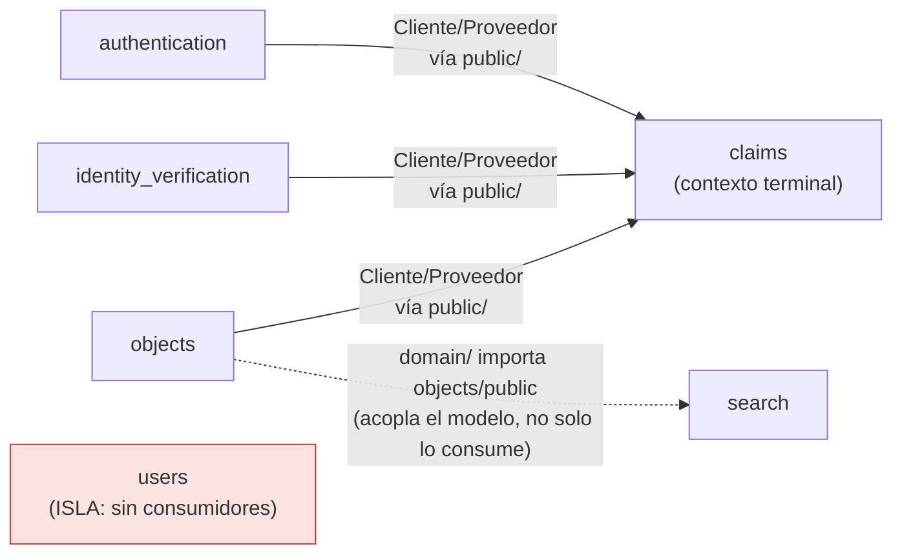

[mapa_contextos.md](https://github.com/user-attachments/files/32450810/mapa_contextos.md)
# Mapa de Contextos — LostVault

## 1. Diagrama de contexto (relaciones confirmadas en el código)

**Tipo de relación dominante:** Cliente/Proveedor vía `public/` (equivalente a un *Open Host
Service*: cada módulo expone un contrato estable en su carpeta `public/` y los demás solo
importan eso). `lib/core/` actúa como un Shared Kernel mínimo (`Result`, `AppInfo`) usado
libremente por todos.

**Relaciones documentadas en `tabla_modulo.md` que NO existen todavía en el código:**
- `users → authentication`
- `users → identity_verification`
- `authentication → objects`

`users/public` no es importado por ningún otro módulo y `users` no está instanciado en
`main.dart`: es un módulo aislado en este corte, pese a que la tabla lo describe como
conectado.

## 2. Tabla módulo → datos, verificada contra el código

| Módulo (dueño) | Dato que posee | Lector(es) según tabla | Verificado en código |
|---|---|---|---|
| `authentication` | Credenciales*, estado de sesión, tokens* | `claims`, `objects` | `claims` (`claim_object_use_case.dart`)   `objects` **no** lo importa |
| `users` | Perfil (nombre, carné, tipo) | `authentication`, `identity_verification` |  `users/public` no es importado por **nadie**. Módulo aislado, no cableado en `main.dart` |
| `objects` | Objeto publicado (descripción, foto, estado) | `search`, `claims` |  ambos confirmados (`objects/public` en `search` y en `claims`) |
| `search` | No posee datos propios | — | correcto, pero su `domain/` importa `objects/public` directamente (acopla el modelo) |
| `claims` | Solicitud de reclamación (estado, reclamante, objeto) | nadie lee directo; invoca `objects.public` | confirmado: `claims` llama `_objects.markAsClaimed()` vía `objects/public` |
| `identity_verification` | Evidencia y resultado de verificación | `claims` | confirmado (`identity_verification/public` en `claim_object_use_case.dart`) |

\* No existe campo de "token" en `AuthUser` (solo `id`, `email`); "credenciales" tampoco se
modela explícitamente aún.

**Regla aplicada:** cada dato tiene un único módulo con permiso de escritura; los demás solo
leen a través del `public/` del módulo dueño. Confirmado: ningún archivo del proyecto importa
`domain/`, `application/` o `infrastructure/` de otro módulo directamente — todos los cruces
pasan por `public/`.

## 3. No conformidades y plan de corrección

| # | No conformidad | Plan de corrección |
|---|---|---|
| NC1 | `users` no tiene ningún consumidor real ni está cableado en `main.dart`, aunque la tabla dice que `authentication` e `identity_verification` lo leen. | Implementar la lectura real vía `users/public` en el módulo que corresponda, o retirar esas filas de la tabla si `users` queda para un incremento futuro. |
| NC2 | `objects` no importa `authentication/public`, aunque la tabla dice que `objects` puede leer datos de `authentication`. | Implementar el caso de uso que justifique esa lectura (p.ej. registrar el autor de la publicación) o eliminar esa relación de la tabla. |
| NC3 | `search/domain/search_result.dart` importa `objects/public` y reutiliza `LostObject` como su propio modelo de dominio (acoplamiento entre bounded contexts). | Crear un value object propio en `search/domain` (p.ej. `SearchResultItem`) y mapear desde `LostObject` en `application/` o `infrastructure/` de `search`, no en `domain/`. |
| NC4 | `AuthUser` no tiene campo de token; la tabla afirma que `authentication` posee tokens. | Agregar el campo si aplica a este corte, o ajustar la redacción de la tabla al modelo real. |
| NC5 | No existía un documento de mapa de contextos (bounded context map) en `docs/ddd/`; solo estaba `tabla_modulo.md`. `docs/c4/contexto.mmd` es C4 Nivel 1 (actores externos), no equivale. | Resuelto por este mismo documento (`docs/ddd/mapa_contextos.md`). |
